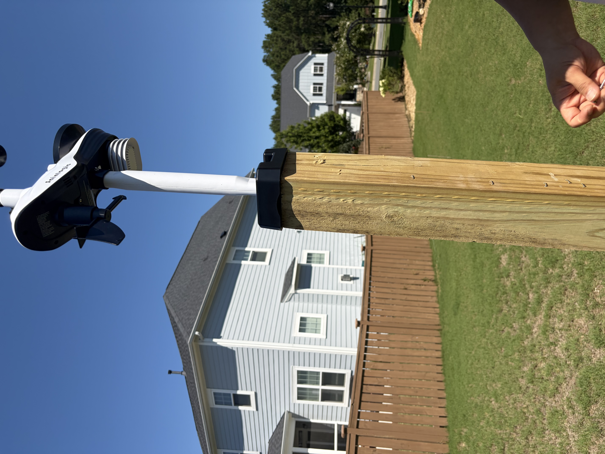

# project-granary

A student-led, hyperlocal weather forecasting research project in development that aims to predict future conditions based on current observations from a weather station.

Project purpose: to study how data from personal weather stations can contribute to hyperlocal weather predictions to improve forecasting in local areas alongside machine-learning models, particularly planned around underserved farming communities in rural areas currently lacking access to accurate weather data provided by geographically close observation stations

Progress as of 2026-7-26:
Sainlogic weather station purchased and en route
Imported historical baseline data from Open-Meteo
Experimental dataset implementation with matplotlib, pandas, and numpy

Roadmap:
Developing a machine learning model to predict hyperlocal weather conditions by training it using historical data from external sources and current data from a personal weather station

Note:
Project Granary is a research project for personal educational uses only, and is not currently configured to provide meteorological or agricultural advice.
